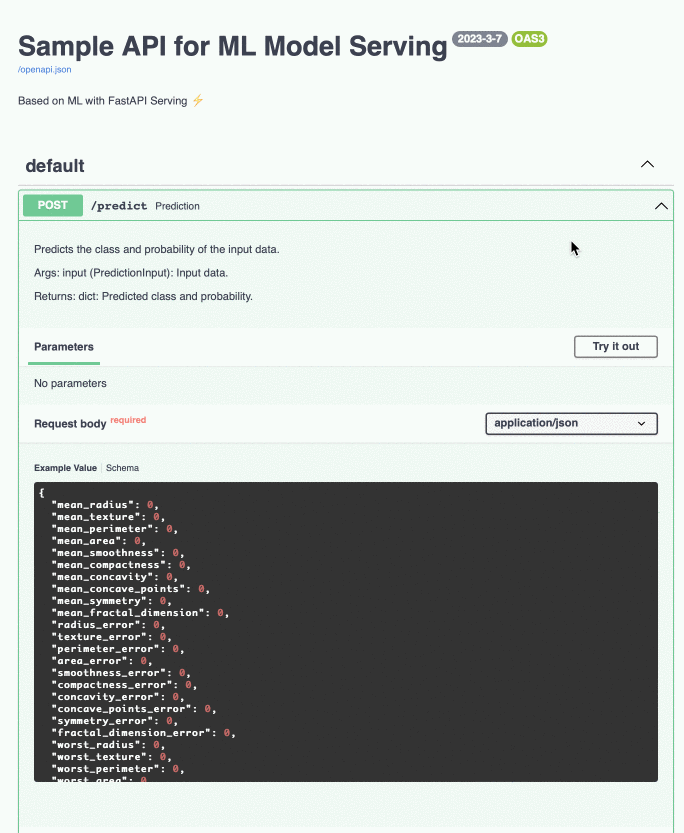

# Sample FastAPI for ML Model Serving
This code is a simple API that serves an ML model using FastAPI. It is intended to be used as a starting point for building more complex ML serving APIs.


### Sample
Here's a sample of what you can expect to see with this project:



# Getting Started

You have two options to start the application: using Docker or locally on your machine.

## Using Docker
Start the application with the following command:
```
docker-compose up
```

## Locally
To start the application locally, follow these steps:

1. Install the required packages:

```
pip install -r requirements.txt
```
2. Start the application:
```
python main.py
```
*Note: You can change the address and port in the config file **config_prod.yml***

## FAST API Docs url:
http://127.0.0.1:8003/docs#/

---
# 🚀 Code Examples

The following code demonstrates how to perform model predict and receive the results in JSON format:
```python
import requests

api_host = 'http://127.0.0.1:8003/'
type_rq = 'predict'

input_data = {
        'mean_radius': 18.94,
        'mean_texture': 21.31,
        'mean_perimeter': 123.6,
        'mean_area': 1130.0,
        'mean_smoothness': 0.09009,
        'mean_compactness': 0.1029,
        'mean_concavity': 0.108,
        'mean_concave_points': 0.07951,
        'mean_symmetry': 0.1582,
        'mean_fractal_dimension': 0.05461,
        'radius_error': 0.7888,
        'texture_error': 0.7975,
        'perimeter_error': 5.486,
        'area_error': 96.05,
        'smoothness_error': 0.004444,
        'compactness_error': 0.01652,
        'concavity_error': 0.02269,
        'concave_points_error': 0.0137,
        'symmetry_error': 0.01386,
        'fractal_dimension_error': 0.001698,
        'worst_radius': 24.86,
        'worst_texture': 26.58,
        'worst_perimeter': 165.9,
        'worst_area': 1866.0,
        'worst_smoothness': 0.1193,
        'worst_compactness': 0.2336,
        'worst_concavity': 0.2687,
        'worst_concave_points': 0.1789,
        'worst_symmetry': 0.2551,
        'worst_fractal_dimension': 0.06589
        }

response = requests.post(api_host+type_rq, json=input_data)

data = response.json()     
print(data)
```

Output:
```
{'prediction_Id': '46400d9d-5178-41a0-a85f-9ffc91d80e92', 'predict': 0, 'predict_prob': 0.0031117206298359678}
```

---
# Test
This repository contains functional tests for a program to ensure the proper operation of the service.

## Getting Started Test
To get started with the testing process, you first need to set up the necessary environment. This can be achieved by either installing the required packages or by running the Docker container.

#### 1. Installing Required Packages:
Run the following command to install the necessary packages:
```
pip install -r requirements.txt
```

Alternatively, you can also run the tests inside a Docker container. To do so, follow these steps:
Start the Docker container:
```
docker-compose up
```
Find the container ID:
```
docker ps
```
Connect inside the container:
```
docker exec -it {CONTAINER_ID}
```

#### 2. Run the tests from the program directory:
Once you have set up the environment, navigate to the program directory and run the tests using the following command:
```
pytest -v --disable-warnings
```

If all tests pass successfully, you will see the following result: 
```bash
tests/test_main.py::test_health_endpoint PASSED               [ 50%]
tests/test_main.py::test_predict PASSED                       [100%]
```


## Dependencies

The following dependencies are required to run this code:

* FastAPI
* uvicorn
* pandas
* numpy
* pydantic
* catboost
* Docker